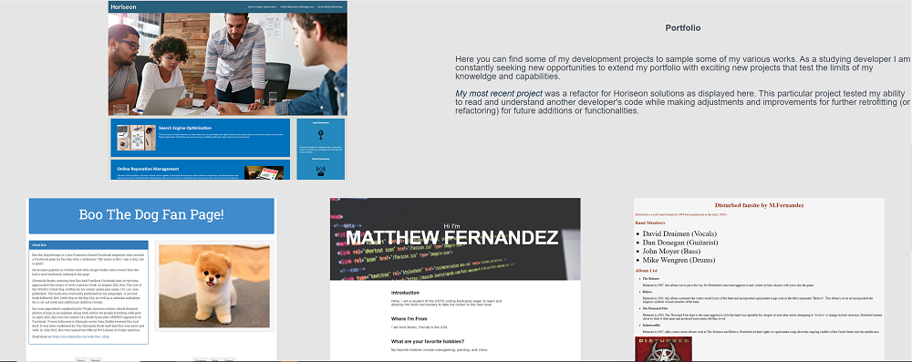

# Portfolio Compilation- Matthew Fernandez

## The Project

This project will serve as my future skeleton for adding portfolio worthy projects completed throughout my experience at Bootcamp and ultimately provide a great place to showcase my skills and abilities to future projects. This project has afforded me a great opportunity to hone and utilize my initial two weeks of html and css languages- mixing them together to form a cohesive and stylistic website to demonstrate my clean scientific style.

## Usage

The various portions of this website provide an excellent skeleton for flex boxes to meet responsive design requirements for mobile and tablet while keeping content contained neatly within their respective fields with zero overflow.

## Credits

Images for Linkedin and Gmail taken from linkedin.com and gmail.com respectively.

Brilliant overlay tutorial found here https://www.youtube.com/watch?v=SXQ9l0ScDEA.

## License

The last section of a high-quality README file is the license. This lets other developers know what they can and cannot do with your project. If you need help choosing a license, refer to [https://choosealicense.com/](https://choosealicense.com/).

## Features

**Flex-box design targeting most mobile phones and tablet parameters.**
**Overlay to help darken overly-bright images.**
**Blue colour palette for additional complimentary colours for those seeking a more varied style without clashing.**
**Hover options that can easily be given borders or animations, cursor decorations etc to meet client needs/demands or even your own stylistic choice!**
**The golden resource of any project, "BOXES WITHIN BOXES". Thats right, save yourself the headache and use my very own babushka boxes and either add your own, flex them in different directions, or add more (at your own peril)**